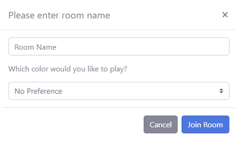

# Notes
NOTE: Currently fixing issue with WebSockets on Google App Engine, game connection isn't working over web. Please visit
<https://github.com/LeQuint/chess-ws/> to set up local WebSocket Server to test out the full functionality of the app.

NOTE: Check out the site at <https://chess-web-app-109.appspot.com/> <br/>

NOTE: The front-end template is taken from <https://github.com/BlackrockDigital/startbootstrap-sb-admin-2>.

## Contents
- [Notes](#notes)
- [Intro](#intro)
- [Design](#design)
  * [Game](#the-game)
  	+ [p5.js](#p5)
    + [Class Structure](#class-structure)
	+ [Game Logic](#game-logic)
    + [WebRTC and WebSockets](#webrtc-and-websockets)

  * [Back-End](#the-backend)
    + [Express Routing](#game-logic)
  	+ [MongoDB and Passport.js](#mongodb-and-passport)

  * [Front-End](#the-frontend)
  * [Deployment](#deployment)

# Intro
The main goal of this project is to get accustomed to the different web technologies and to play around with WebSockets and WebRTC to implement a serverless connection which allows users to send each other data. The different web technologies incorporated in this project are:

-   Node.js & Express for back-end
-	MongoDB & Passport.js for user validation
-   EJS layouts & BootStrap for front-end
-   WebRTC & WebSockets for real-time connection between users
-	p5.js to render graphics and implement game logic
-	Google App Engine for deployment


# Design
The sections below will cover the implementation and documentation of this web app. Please note this project is for educational purposes so the code may not be suitable for a production enviroment.

## The Game
The game of chess was chosen since it is somewhat algorithmically challenging to implement while requiring minimal graphicial rendering. Aside from the p5 library used to render the graphics, everthing else is coded from scratch using ECMA6 JavaScript.

### p5
The p5 library provides a very simple way to generate graphics as well as a set of tools to facilitate user interactions. For these reasons, it made it very suitable for developing a simple game such as chess. If you look in [sketch.js](/gamefiles/sketch.js), you will see the main structure p5 uses to render graphics.

```javascript
function setup() {
    var canvas = createCanvas( TILESIZE * 8, TILESIZE * 8 );
    canvas.parent('sketch-holder');
    board = new Board();
    noLoop();
}

function draw() {
    drawBoard();
    drawPieces ( board );
    drawValidMoves();
}
```
```setup()``` is ran once the library is loaded and once the ```loop()``` function is called, the library will continuously loop over ```draw()``` to render a view. Other helper function such as ```mousePressed()``` and ```mouseReleased()``` were used to allow the user to interact with the game.

### Class Structure
The game has two main classes, ```Board``` and ```piece``` which can be seen at [board.js](/gamefiles/board.js) and [pieces.js](/gamefiles/pieces.js).
```javascript
class Board {
    constructor() {
     this.whitePieces = [];
     this.blackPieces = [];
     this.indexBeingMoved;
     this.colorBeingMoved;
     this.setupPieces();
    }
    setupPieces() {
      /* ...  */
    }
}
class piece {
    constructor(xcoord,ycoord, pieceImage, pieceColor){
        this.xcoord = xcoord;
        this.ycoord = ycoord;
        this.beingMoved = false;
        this.image = pieceImage;
        this.pieceColor = pieceColor;
        this.firstMove = true;
        this.mute = false;
    }
}
```

Each chess piece inherits the properties of ```piece ``` and has two main functions to facilitate game logic:
1. ```generateValidMoves()``` - Interates the board to see which moves are valid for that piece in that given turn
2. ```generateBoardControl()``` - Generates the board control of that given piece at its current board position

The ```Board``` class acts as the parent object to all pieces and keeps track of all the pieces and game information. The board grid is set up starting from (0,0)
in the top left corner and increments downwards and leftwards to (7,7) to for a 8x8 chess board.

### Game Logic
All supporting functions are located at [gameLogic.js](/gamefiles/gameLogic.js). The functions consist of:
1. Search functions such as ```returnPieceAt(xcoord,ycoord)``` which returns the piece at a given position by reference
2. Validation functions such as ```checkIfMovingThrough(...)``` and ```checkIfPieceIsHere(xcoord,ycoord)```
3. And functions which handles game mechanics such as ```castleLogic(piece)``` and ```evolve(pawn, index)```


### WebRTC and WebSockets
For a user to connect to another user, they simply have to specify a room number in the game menu 
 

The code in [/RTC](/RTC) handles the rest of the connection. Please visit: <https://codelabs.developers.google.com/codelabs/webrtc-web/> for a in depth explanation of the code. Here is a simplified explanation:
1. The ```var signalSocket``` object establishes a connection with the websocket server
2. Once connected, the ```signalSocket``` object is used to send messages to the websocket server to join a room
3. If two users have joined the same room, the websocket server initialises the peer-to-peer connection between the two parties
4. Once the two users are connected, they can send data directly to each other using the ```sendData(...)``` method
5. When the connection is terminated between the users, they both inform the websocket server and are removed from the rooms

## The Backend
Libraries used in the back-end

1. express-ejs-layouts - to assemble ejs views and serve to front-end
2. mongoose - to abstract away the MongoDB Atlas API
3. connect-flash - to display flash messages to the user
4. express-session - storing user information between pages
5. passport - for user validation
6. bcryptjs - to encrypt/decrypt user password
7. express - for routing and server logic

### Express Routing
The starting point for the backend is [app.js](/app.js) which also includes [index.js](/routes/index.js) and [user.js](/routes/index.js). index.js contains all the route handles once user has logged in and user.js handles all the routes before login. Since express-ejs-layouts automatically searches within the /views folder for routes, all directory references had to be explicitly declared as follows in app.js

```javascript
app.use('/', require('./routes/index'));
app.use('/users', require('./routes/users'));
app.use('/gamefiles', express.static(__dirname + "/gamefiles"));
app.use('/images', express.static(__dirname + "/gamefiles/images"));
app.use('/js', express.static(__dirname + "/js"));
app.use('/css', express.static(__dirname + "/css"));
app.use('/RTC', express.static(__dirname + "/RTC"));
 ```

### MongoDB and Passport
The database schema is in [User.js](/models/Users.js) and the authentication strategy is in [authentication.js](/config/authentication.js). Please note that key.js is not commited to public repository since it contains login information to my MongoDB Atlas account. 

Each user entry stores very basic information as shown in the following database schema:
```javascript
const UserSchema = new mongoose.Schema({
    name: {
        type: String,
        require: true
    },
    email: {
        type: String,
        require: true
    },
    password: {
        type: String,
        require: true
    },
    date: {
        type: Date,
        default: Date.now
    },

    wins: {
        type: Number,
        default: 0
    },

    losses: {
        type: Number,
        default: 0
    },
})
```

## The Frontend
EJS views are stored in the [/views](/views) folder and each component/partials is under [/views/partials](/views/partials). Only one layout is used for all pages in this project and can be seen [here](/views/layout.ejs). Bootstrap and Font Awesome are used for styling and grid organization. 

## Deployment
The app is deployed to Google App Engine by following the instructions at: <https://cloud.google.com/appengine/docs/standard/nodejs/quickstart> <br>
I am currently working on the deployment of the WebSocket server. The code for the WebSocket server can be seen at <https://github.com/LeQuint/chess-ws>

