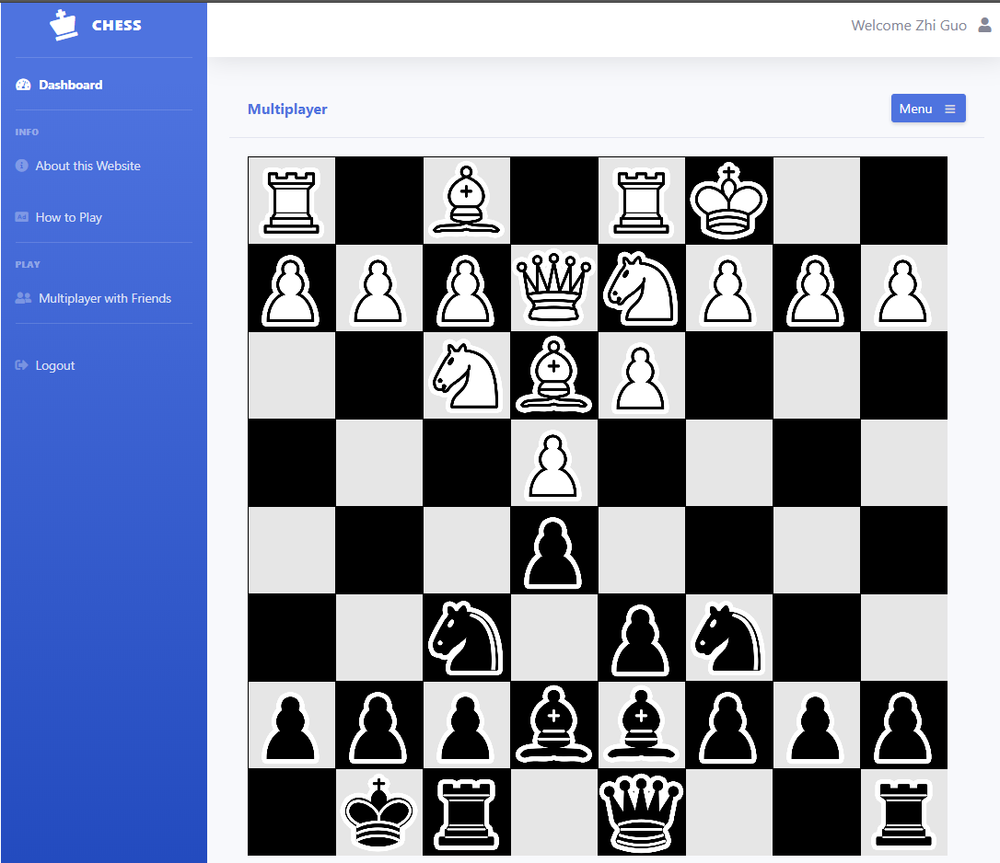

# Notes
NOTE: Currently fixing issue with WebSockets on Google App Engine, game connection isn't working over web. Please visit
<https://github.com/LeQuint/chess-ws/> to set up local WebSocket Server to test out the full functionality of the app.

NOTE: The following content will go over the design and implementation of my chess web app. Check out the site at <https://chess-web-app-109.appspot.com/> <br/>

## Contents
- [Notes](#notes)
- [Intro](#intro)
- [Design](#design)
  * [Game](#the-game)
  	+ [p5.js](#p5)
    + [Class Structure](#class-structure)
    + [WebRTC and WebSockets](#webrtc-and-websockets)

  * [Back-End](#the-backend)
  	+ [MongoDB and Passport.js](#mongodb-and-passport)
    + [Express Routing](#game-logic)

  * [Front-End](#the-frontend)
  * [Deployment](#deployment)

- [Testing and Debugging](#testing-and-debugging)
- [Future Considerations](#future-considerations)


# Intro
The main goal of this project is to get accustomed to the different web technologies and to play around with WebSockets and WebRTC to implement a serverless connection which allows users to send each other data. The different web technologies incorporated in this project are:

-   Node.js & Express for back-end
-	MongoDB & Passport.js for user validation
-   EJS layouts & BootStrap for front-end
-   WebRTC & WebSockets for real-time connection between users
-	p5.js to render graphics and implement game logic
-	Google App Engine for deployment

The front-end template is taken from <https://github.com/BlackrockDigital/startbootstrap-sb-admin-2>. Everything else was built from scratch.


# Design
This section will cover the design and implementations of this web app. Please note this project is for educational purposes so the code may not be suitable for a production enviroment.

## The Game
The game of chess was chosen since it is somewhat algorithmically challenging to implement while requiring minimal graphicial rendering. Aside from the p5 library used to render the graphics, everthing else is coded from scratch using ECMA6 JavaScript.

### p5
The p5 library provides a very simple way to generate graphics as well as a set of tools to facilitate user interactions. For these reasons, it made it very suitable for developing a simple game such as chess. If you look in /gamefiles/sketch.js, you will see the main structure p5 uses to render graphics.

```javascript
function setup() {
    var canvas = createCanvas( TILESIZE * 8, TILESIZE * 8 );
    canvas.parent('sketch-holder');
    board = new Board();
    noLoop();
}

function draw() {
    drawBoard();
    drawPieces ( board );
    drawValidMoves();
}
```
```setup()``` is ran once the library is loaded and once the ```loop()``` function is called, the library will continuously loop over ```draw()``` to render a view. Other helper function such as ```mousePressed()``` and ```mouseReleased()``` were used to allow the user to interact with the game.

### Class Structure
The game has two main classes, ```Board``` and ```piece```

### WebRTC and WebSockets

## The Backend

### MongoDB and Passport

### Express Routing

## The Frontend

## Deployment

# Testing and Debugging

# Future Considerations
